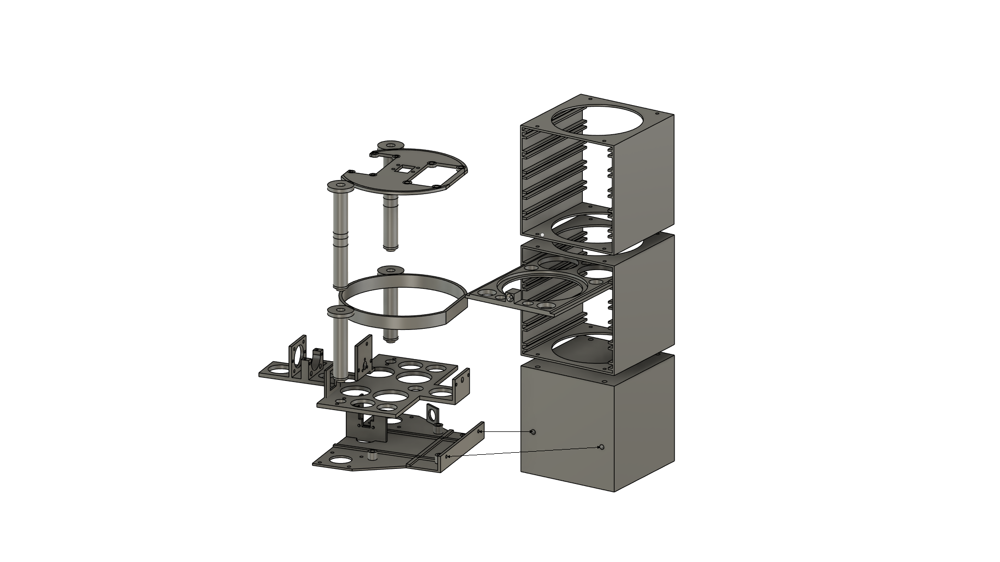

A tool to automatically take photographs of petri dishes.

* Holds up to 10 petri dishes
* Frequency of photographs is configurable between 4-24 hours
* Create timelapse images of bacteria and fungus growth

## Setup Guide

### Build MAPT tower

1. [Go to the project page on Printables](https://printables.com).
2. Print all the parts
3. Assemble

### Install firmware

1. Use the Raspberry Pi Imager to prepare an SD card with "Raspberry Pi OS Lite (**32-bit**)"
 * The "Lite" version can be found under Operating System > Raspberry Pi OS (other) > Raspberry PI OS Lite (32-bit)
2. When asked to apply customization options, choose "Edit Settings":
 * Enter your wifi details
 * Enter a username and password
 * Enable SSH (under the Services tab)
 * Change any other settings you like
3. Continue through the Raspberry Pi Imager prompts to finish preparing the SD card
4. Insert the SD card into the Raspberry Pi and power it on
5. Wait for the Raspberry Pi to boot and connect to the wifi network
6. [Use ssh to connect to the Raspberry Pi](https://learn.adafruit.com/adafruits-raspberry-pi-lesson-6-using-ssh/ssh-under-windows) (Note: use the username you created in step 2 instead of 'pi')
7. Run this command to install the MAPT firmware: `curl https://biomapt.github.io | bash`

## Usage Guide

TODO
